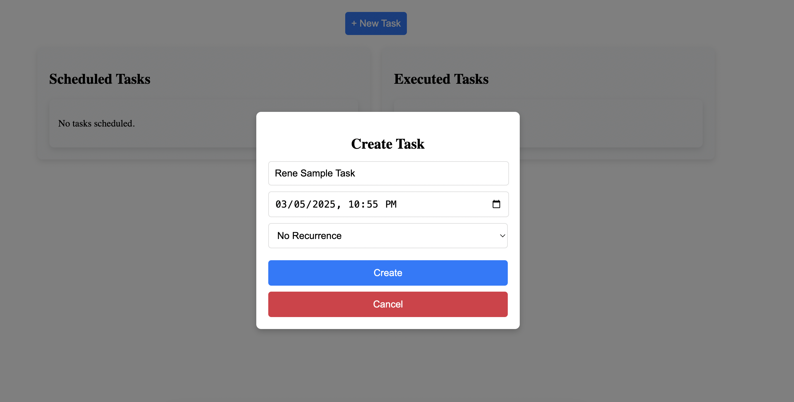
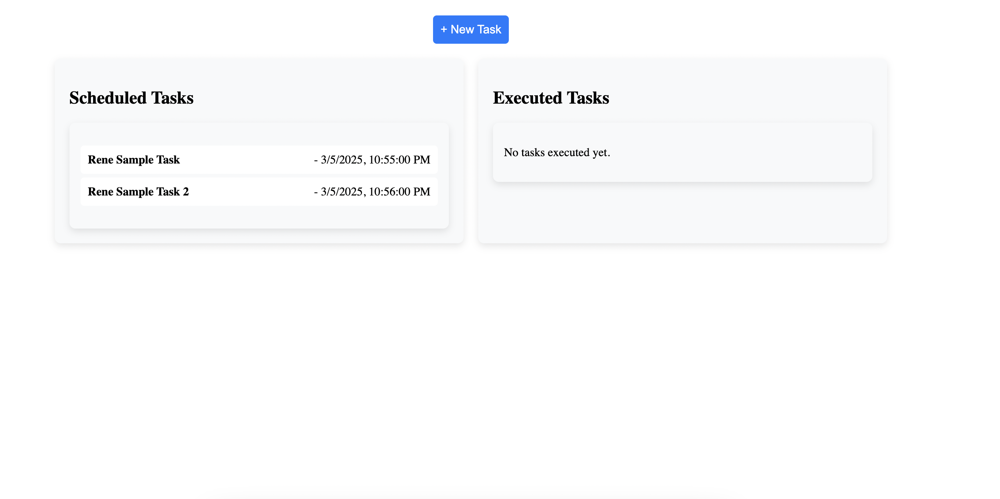
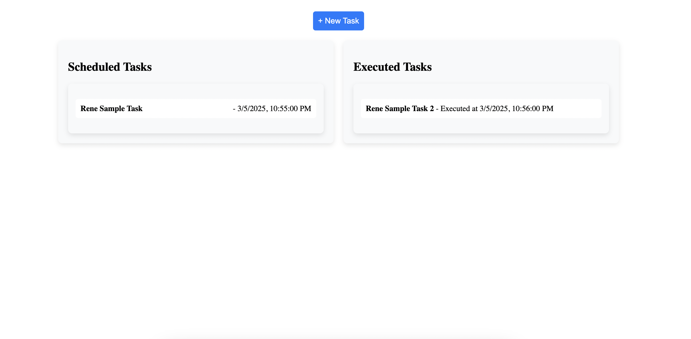
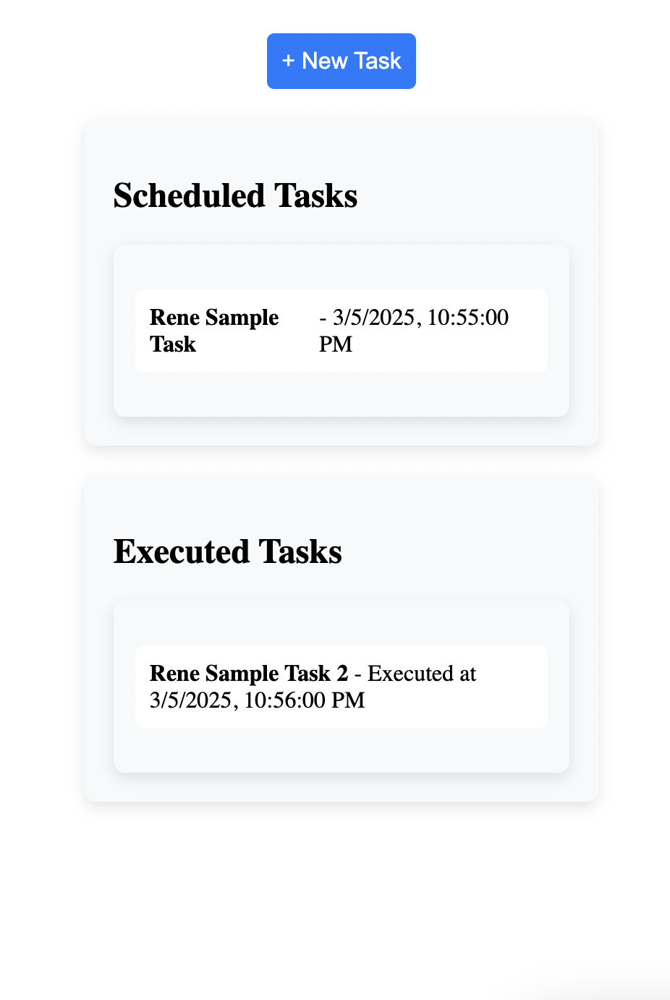

# Task Scheduler Prototype

## Project Overview
This is the **Distributed Task Scheduler** prototype required on the takehome challenge

## Design Document
The design document can be found at the root of this project with the name **Task_Scheduler.pdf**

## Technologies Used
- **Backend:** Node.js, Express, TypeScript
- **Frontend:** React, Context API

## Installation & Setup

### Run Without Docker
#### Backend Setup
```sh
cd backend
npm install
npm run dev  # Runs the backend on PORT 3001
```
#### Frontend Setup
```sh
cd ../frontend
npm install
npm start  # Runs the frontend on PORT 3000
```
#### Running Both Services Together
In the root directory, run:
```sh
npm install
npm run start  # Runs backend & frontend in parallel
```


### Run with Docker
#### Install Docker & Run Containers
```sh
docker-compose up --build
```
### Access the App
- **Backend:** [http://localhost:3001](http://localhost:3001)
- **Frontend:** [http://localhost:3000](http://localhost:3000)

### Stop Containers
```sh
docker-compose down
```

## Screenshots
### Task Input Form


### Scheduled Tasks


### Scheduled Tasks


### Mobile View
